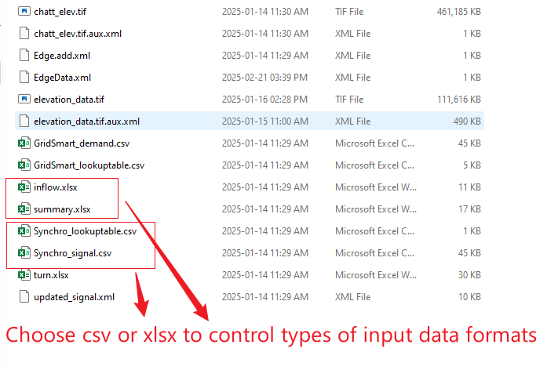
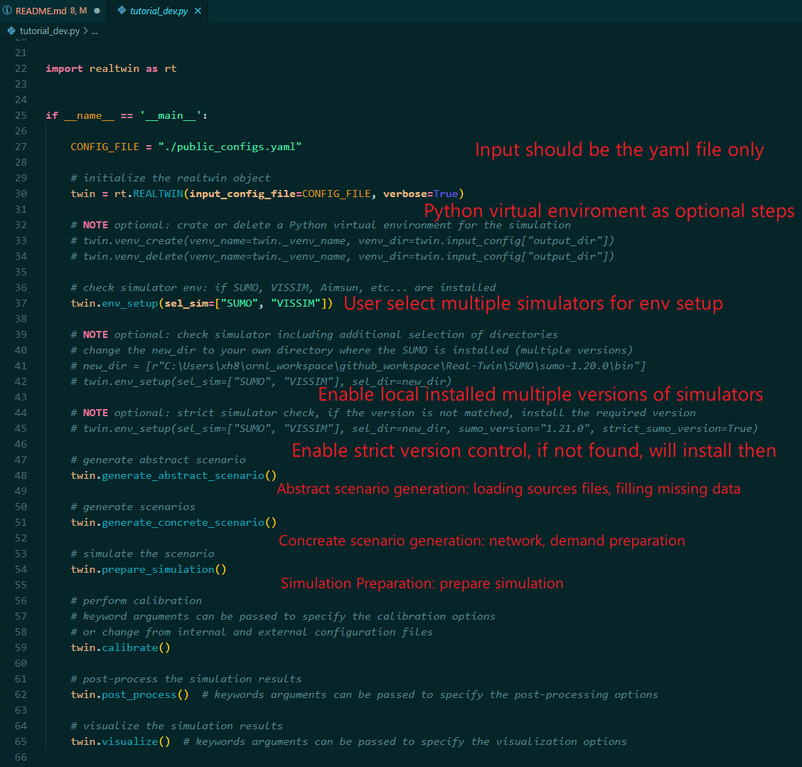
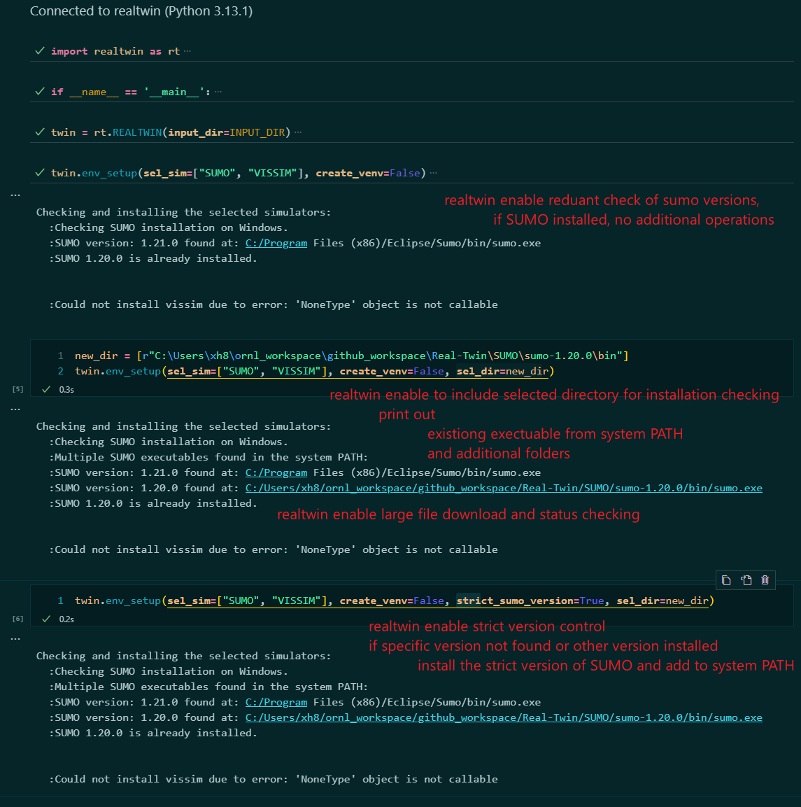
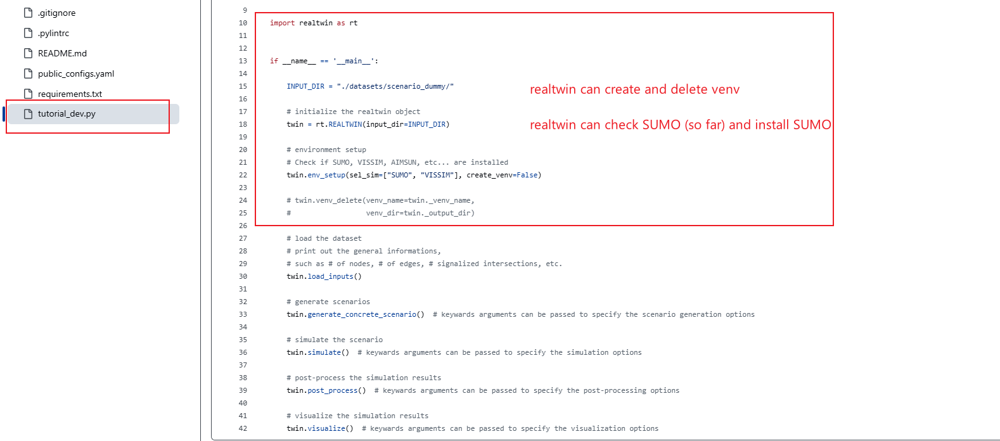
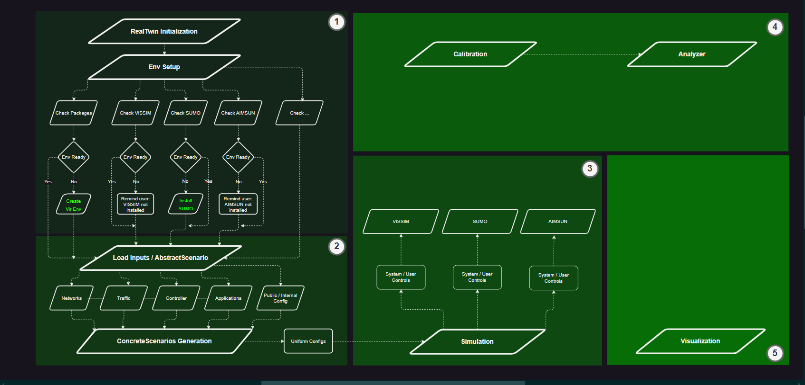

# Real-Twin

**(Feel free to revise the document to enhance the accuracy and readability)**

The real-twin developed by ORNL Applied Research and Mobility System (ARMS) group that enables the simulation of twin-structured cities.

## Change Log

**Change Log section will eventually be moved to CHANGLOG.md (currently maintained in README.md for development).**

### 2025-02-27

#### Discussion

* Input files are mixing of xlsx, csv files. We need to choose either xlsx or csv to make inputs uniform

* The generated SUMO network failed during the calibration process.
* Decide whether to create public or private real-twin repositories on GitHub.
* Achieve 60% integration of the calibration section.

#### TODO

    Continueous integration contineous delivery

### 2025-01-24

* realtwin package enables Abstrace Scenario, Concrete Scenario, and Simulation generation using SUMO
* code checking and updates to score of 9.5+ / 10
* updated test functions
* update gitignore file to ignore .tif files as .tif files are too large (100MB+)
* update tutorial_dev to make clear explanation for both user and internal developers
* update requirements to enable simulation
* update configuration file to auto load  and fill missing data from loading

  

#### TODO

* Explore calibration codes for sumo

### 2025-01-03

* add several test functions: find executable, download file, simulation environment ect...
* get familiar with existing framework, eg. scenariogeneration, utdf singal conversion from Guanhao's code ect...

#### TODO

* need more time to get familar with the currently framework - current SOW, time plan, develiverables ect...

### 2024-12-31

* add func: sumo version check from all existing exectuables
* add func: enable strick sumo version check: if not installed, will install the specific version of sumo
* add func: download large single file from web with security check and process checking
* add func: find executable from system path
* add func: find executable from selected directory
* fmt: format print out message for better progress representation

  

#### TODO

* get familiar with input loads (request access to shared local testing files)
* get familiar with existing visualizations (coordinate with group members and request access to their local files)

### 2024-12-30

* add tutorial_dev.md file for user & developer reference
* add test functions for the input_dir, output_dir ect...
  figure

#### TODO

* check sumo version if sumo pre-installed on user's device
* get familiar with input loads (request access to shared local testing files)
* get familiar with existing visualizations (coordinate with group members and request access to their local files)

### 2024-12-27

* add .pylintrc file for project-wide coding control
* refactored code to reach production-level
* test the current functionalities: including create venv, delete venv, check SUMO and install SUMO
* tutorial_dev.py

  

#### TODO:

* Discussion the repository license: MIT, Apache, BSD etc..., as we are writing code, we need copyright licence text as Docstring at the top of each file created.
* Add test functions perform object safety check

### 2024-12-26

* enable pylint for checking / evaluating coding for GitHub Action
* add code evaluation fuction (local checking) to perform code checking and evaluation (navigate to tests folder: pylint_proj_code_checker.py)
* update requirements.txt
* add official copyright for each document for the requirement of software development under ORNL
* add test functions

#### TODO:

* discuss the repository license: MIT, Apache, BSD etc..., as we are writing code, we need copyright licence text as Docstring at the top of each file created.
* add more test functions perform object safety check

### 2024-12-23

* re-design the realtwin development framework
* re-design the overall package framework
* add utility functions: is_sumo_installed
* add utility functions: venv_create, venv_delete
* add func_lib in install_simulator: install_sumo_windows
* add test function: test_is_sumo_installed
* 

#### TODO:

* Test the overall functionalities
