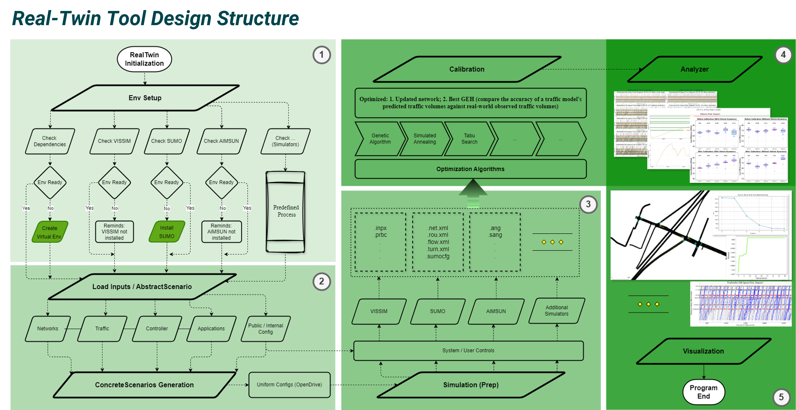

# Summary

**Real-Twin** is a unified, **simulation platform-agnostic scenario generation tool** designed to streamline and standardize the evaluation of emerging mobility technologies. It provides an end-to-end framework that includes robust workflows, integrated tools, and comprehensive metrics to generate, calibrate, and benchmark microscopic traffic simulation scenarios across multiple platforms.

### Key Features

* **Unified Scenario Generation** : Generate transferable, simulation-ready scenarios from heterogeneous data sources using a consistent workflow.
* **Automated Calibration Workflow** : Bridges simulation and real-world data, minimizing manual effort and making traffic simulation more accessible to researchers and engineers.
* **Simulation Platform Compatibility** : Supports  **SUMO** ,  **VISSIM** , and **AIMSUN** for cross-platform scenario generation and benchmarking. Enables reliable comparisons and reproducibility across different simulation tools.
* **Consistent Scenarios across Different Simulators** : Generate comparable simulation scenarios across different microscopic traffic simulators, providing users the ability to conduct benchmarking and cross-validation that are crucial for ensuring the reliability and reproducibility of simulation results.
* **Emerging Technology Support** : Includes a scenario database and pipeline for studying  **autonomous vehicles (AVs)** , with planned extensions to  **CAVs** ,  **EVs** , and other advanced technologies.

# Statement of need

Traffic simulation is an effective tool for urban planners, traffic engineers, and researchers to study traffic. In particular, microscopic traffic simulation, which simulates individual vehicles' movements within a transportation network, has demonstrated its importance in analyzing and managing transportation systems. However, integrating data from various sources, generating traffic scenarios, and importing information into traffic simulators to conduct microscopic simulations have always been a challenge. Following a streamlined scenario generation and calibration workflow, realtwin package effectively bridges gaps between traffic data from various sources and traffic simulators, making microscopic traffic simulation more accessible for researchers and engineers across various levels of expertise. Using realtwin to generate a real-world traffic scenario in SUMO, VISSIM, and AIMSUN, realtwin's ability is demonstrated in the construction of realistic and consistent traffic scenarios in different simulators - `[@ehlert2001microscopic; @hidas2002modelling; @chu2003calibration]`.

Microscopic traffic simulation relies on accurately defined scenario elements (network topology, traffic demand, and control infrastructure) to produce realistic and reproducible results. In practice, these elements originate from disparate data sources (e.g., GIS files, travel‐demand databases, signal timing plans) and must be transformed into simulator‐specific formats (SUMO, VISSIM, AIMSUN, etc.). Converting raw data into each simulator’s required schema often involves extensive manual post‐processing: for example, translating OD matrices into route definitions, mapping lane configurations into simulator network files, or adjusting car‐following parameters to reflect a desired market share of Level 2 autonomous vehicles. Even for relatively small intersections, preparing a valid microscopic traffic scenario can take tens of minutes; for city‐scale or region‐wide studies, researchers frequently spend days or weeks on data integration and formatting alone. Furthermore, slight inconsistencies in network geometry or vehicle behavior parameters across simulators undermine cross‐validation efforts, making it difficult to reproduce results or systematically compare the effects of emerging technologies (e.g., CAVs, EVs) on mobility, energy consumption, and safety.

The **realtwin** package addresses these challenges by automating the end-to-end scenario generation and calibration workflow for multiple microscopic simulators. Users supply high-level inputs (demand matrices, control logic) and **realtwin** automatically assembles simulation‐ready files for SUMO, VISSIM, and AIMSUN. Behind the scenes, the **realtwin** package maintains a unified internal representation of each scenario element (network, demand, infrastructure, vehicle types), applies consistent car-following and lane-changing conversions (including adjustments for partial automation levels), and outputs properly structured simulator files. By encapsulating common data transformations (for example, converting shapefile attributes to SUMO’s XML schema or translating signal phase plans into VISSIM’s controller format), realtwin dramatically reduces the manual effort required to build and calibrate microscopic scenarios.

Moreover, the **realtwin** package provides a built-in database and pipeline for generating scenarios that incorporate emerging technologies. Current functionality supports stochastic insertion of Level 2 and higher autonomy vehicles in SUMO; planned extensions will enable similar workflows for VISSIM and AIMSUN, as well as EV charging behavior models. This extensible architecture allows researchers to define consistent vehicle‐composition parameters (e.g., 50 % Level 2 automation) and seamlessly incorporate them into each supported simulator. As a result, realtwin not only accelerates scenario preparation—reducing setup time from days to a few minutes—but also ensures cross‐simulator consistency, enabling rigorous benchmarking and reproducible studies of how innovations like connected/autonomous vehicles affect traffic flow, energy use, and safety outcomes - `[@Xu:2025]`.


# Design Framework



# Hands-On Tutorial

For detailed documentation: [Official Documentation](https://real-twin.readthedocs.io/en/latest/)

```python

import realtwin as rt

# Please refer to the official documentation for more details on RealTwin preparation before running the simulation

if __name__ == '__main__':

    # Step 1: Prepare your configuration file (in YAML format)
    CONFIG_FILE = "./realtwin_config.yaml"

    # Step 2: initialize the realtwin object
    twin = rt.RealTwin(input_config_file=CONFIG_FILE, verbose=True)

    # Step 3: check simulator env: if SUMO, VISSIM, Aimsun, etc... are installed
    twin.env_setup(sel_sim=["SUMO", "VISSIM"])

    # Step 4: Create Matchup Table from SUMO network
    updated_sumo_net = r"./datasets/example2/chatt.net.xml"
    twin.generate_inputs(incl_sumo_net=updated_sumo_net)

    # BEFORE step 5, there are three steps to be performed:
    # 1. Prepare Traffic Demand and save it to Traffic Folder in input directory
    # 2. Prepare Control Data (Signal) and save it to Control Folder in input directory
    # 3. Manually fill in the Matchup Table in the input directory

    # Step 5: generate abstract scenario
    twin.generate_abstract_scenario()

    # AFTER step 5, Double-check the Matchup Table in the input directory to ensure it is correct.

    # Step 6: generate scenarios
    twin.generate_concrete_scenario()

    # Step 7: simulate the scenario
    twin.prepare_simulation()

    # Step 8: perform calibration, Available algorithms: GA: Genetic Algorithm, SA: Simulated Annealing, TS: Tabu Search
    twin.calibrate(sel_algo={"turn_inflow": "GA", "behavior": "GA"})

```

# Acknowledgements

  - We thank the City of Chattanooga for sharing their city-wide historical and real-time traffic and signal data.

  - This work was supported by the US Department of Energy, Vehicle Technologies Office, Energy Efficient Mobility Systems (EEMS) program, under project Real-Twin (EEMS114).

# References
